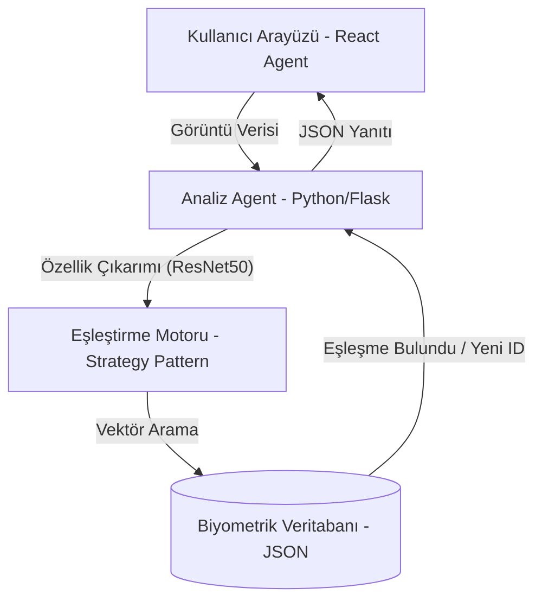

# 🐢 TurtleVision: Derin Öğrenme Tabanlı Çok Etmenli Sistem (MAS)

Deniz kaplumbağalarını yüz/kabuk desenlerinden (biyometrik) otonom olarak tanımlamak için geliştirilmiş, Derin Öğrenme tabanlı çok etmenli bir sistem mimarisidir.

Bu sistem, geleneksel markalama yöntemlerine zarar vermeyen (Non-Invasive) bir alternatif sunarak araştırmacıların popülasyon takibi yapmasını sağlar.

## 🌟 Öne Çıkan Özellikler

- **AI Biometric Identification**: ResNet50 modelini kullanarak kaplumbağa yüz desenlerinden 128 boyutlu benzersiz vektörler (parmak izi) çıkarır.
- **Multi-Agent System (MAS)**: Analiz, Eşleştirme ve Veri yönetimi otonom ajanlar tarafından koordine edilir.
- **SOLID Architecture**: Benzerlik hesaplama motoru, **Strategy Pattern** kullanılarak "Open/Closed" prensibine uygun şekilde geliştirilmiştir.
- **Kullanıcı Deneyimi**: Akademik sunum için optimize edilmiş, temiz ve sade kullanıcı arayüzü.
- **Offline-First Intelligence**: SeaTurtleID2022 veri seti ile entegre, internet bağımsız yüksek hızlı biyometrik arama.
- **Top-N Alternatives**: Sadece tek bir sonuç değil, en benzer ilk 3 kaydı görselleriyle birlikte sunan analiz raporu.

## 🏗️ Sistem Mimarisi

## 🛠️ Teknoloji Yığını

- **Frontend**: React 18, Vite, Tailwind CSS, Lucide Icons
- **Backend (AI Engine)**: Python 3.x, Flask, OpenCV, PyTorch (ResNet50)
- **Veritabanı**: JSON tabanlı NoSQL kalıcılığı (Kaggle veri seti entegreli)

## 🧪 Test Senaryosu

1.  **Sisteme Giriş:** `Login` ekranından güvenli giriş yapın.
2.  **Toplu İçe Aktarma:** Masaüstündeki `images` klasörünü `import_images.py` ile sisteme tanıtın.
3.  **Biyometrik Analiz:** "Yeni Analiz" kısmından, veritabanında olan bir kaplumbağanın farklı bir fotoğrafını yükleyin.
4.  **Doğrulama:** Sistemin **ResNet50** ajanının milisaniyeler içinde çalışıp, doğru kaplumbağayı %80+ benzerlikle bulduğunu gösterin.
5.  **Mimari Kanıt:** Kodun `TurtleMatcher` sınıfındaki **Strategy Pattern** yapısını göstererek SOLID prensiplerine vurgu yapın.

## 📜 Lisans
Bu proje akademik amaçlarla geliştirilmiş olup MIT lisansı altındadır.
