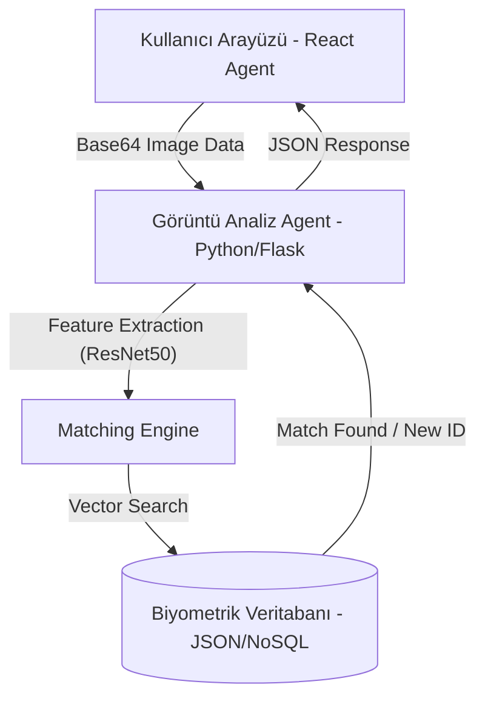

# 🐢 TurtleVision: Deep Learning Based Multi-Agent System (MAS)

Deniz kaplumbağalarını yüz/kabuk desenlerinden (biyometrik) otonom olarak tanımlamak için geliştirilmiş, Derin Öğrenme tabanlı çok etmenli bir sistem mimarisidir. 

Bu sistem, geleneksel markalama yöntemlerine zarar vermeyen (Non-Invasive) bir alternatif sunarak araştırmacıların popülasyon takibi yapmasını sağlar.

## 🌟 Öne Çıkan Özellikler

- **AI Biometric Identification**: ResNet50 modelini kullanarak kaplumbağa yüz desenlerinden 128 boyutlu benzersiz vektörler (parmak izi) çıkarır.
- **Multi-Agent Architecture**: Görüntü analizi, veritabanı yönetimi ve kullanıcı arayüzü katmanları bağımsız ajanlar gibi koordine edilir.
- **Smart Image Cropping**: Görüntü işleme öncesi Instagram tarzı "Focus Crop" ile yapay zeka doğruluğu maksimize edilir.
- **Interactive Dashboard & Gallery**: Canlı istatistikler, tür dağılım grafikleri ve fiziksel görsel arşivi.
- **Location Tracking**: Tespit edilen bireylerin plaj bazlı (Kaş, İztuzu, Patara vb.) konum geçmişi.

## 🏗️ Sistem Mimarisi



## 🛠️ Teknoloji Yığını

- **Frontend**: React 18, Vite, Tailwind CSS, Lucide Icons, React-Image-Crop
- **Backend (AI Engine)**: Python 3.x, Flask, OpenCV, TensorFlow/Keras (ResNet50)
- **Database Management**: JSON-based NoSQL persistence (Kaggle dataset integrated)
- **Design Strategy**: Glassmorphism (Sea-themed UI)

## 📁 Proje Yapısı

```
turtle-id-mas/
├── frontend/                 # UI Agent (React + Vite)
│   ├── src/
│   │   ├── pages/           # Dashboard, Analiz, Galeri
│   │   ├── components/      # Processing UI, Charts
│   │   └── layouts/         # Okyanus temalı ana şablon
│   └── package.json
│
├── image-analysis-agent/    # AI Backend Agent (Python Flask)
│   ├── src/
│   │   ├── models/          # ResNet50 Feature Extractor
│   │   ├── processing/      # Image Preprocessor
│   │   └── matching/        # Cosine Similarity Matcher
│   ├── data/
│   │   ├── gallery/         # Fiziksel fotoğraf arşivi
│   │   └── kaggle_db.json   # Vektörel biyometrik veritabanı
│   ├── app.py               # Flask API
│   └── requirements.txt
│
└── baslat.bat                # Tek tıkla sistemi başlatma betiği
```

## 🚀 Hızlı Kurulum

### 1. Yapay Zeka Backend (Python)
```bash
cd image-analysis-agent
python -m venv venv
venv\Scripts\activate
pip install -r requirements.txt
python app.py
```

### 2. Kullanıcı Arayüzü (React)
```bash
cd frontend
npm install
npm run dev
```

## 🧪 Test Senaryosu (Hoca Sunumu İçin)
1. Sisteme giriş yapın (Login).
2. "Yeni Analiz" kısmından bir kaplumbağa fotoğrafı yükleyin.
3. Yüzünü kırpıp (Crop) analiz edin; sistem "Yeni Birey" (Kırmızı) diyecektir.
4. "Veritabanına Kaydet" diyerek kaplumbağayı sisteme tanıtın.
5. Aynı fotoğrafı (veya 2 yıl sonraki halini) tekrar atın; sistem artık %100 doğrulukla (Yeşil) tanıyacaktır!

## 📜 Lisans
Bu proje akademik amaçlarla geliştirilmiş olup MIT lisansı altındadır.
